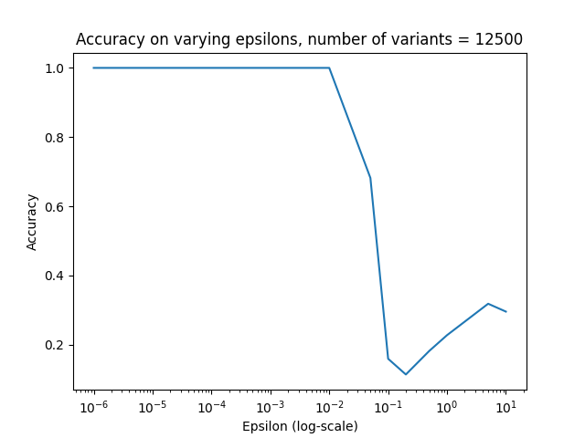

# Human Chromosome 6 privacy challenge, attempt at solution

This is an attempt at solving the [Human chromosome 6 privacy callenge](https://privvg.github.io/2022/09/30/human-chromosome-6-privacy-challenge.html).

We believe the following is the solution to the challenge:

```
0.fa.gz: No individual has been removed
1.fa.gz: HG01978 has been removed
2.fa.gz: HG01891 has been removed
3.fa.gz: HG02109 has been removed
4.fa.gz: HG02572 has been removed
5.fa.gz: HG03540 has been removed
```

### Reproducing
The above predictions can be reproduced by cloning this repository and running the snakemake pipeline:
```bash
# first install python dependencies (these are not automatically installed through conda)
python3 -m pip install requirents.txt

# Odgi and other tools required will be automatically installed through conda when you run the snakemake pipeline:
snakemake --cores 8 --resources mem_gb=30 --use-conda challenge_solution.txt
```
The above command takes 2-3 hours to run and requires at least 16 GBs of RAM. Below is an explanation of how we attempted to solve the challenge, and we also show some examples with smaller simulated data sets that more easily can be re-run.

## Overview of our solution
* We assume we have an original non-private graph `A` and an epsilon-differentially private graph `B` which is created after removing an unknown individual `i` from `A`. Both graphs contain paths (in the challenge we only observe the sequences of the paths of B). 
* We hypothesise that if something is wrong with the privvg-implementation, then for nodes covered by the individual `i` in `A`, we should be able to observe lower than expected coverage of paths over these nodes in `B` (intuitively because fewer paths will be sampled from nodes covered by `i` when `i` has been removed). 
* We don't have access to the graph `B`, but we have access to the error-free sampled path sequences. This means that one should be able to quite easily reconstruct `B` by mapping these path sequences to `A`.
* Then to test whether an individual `i` seems to have been removed when creating `B`, one can check every node that this individual has in graph `A` and that also few other individuals have. If such nodes are covered less than expected by paths in `B` we may conclude that `i` has been removed. It is not obvious what "less than expected" would be here, but one could perform this analysis for all individuals and pick the individual that seems to be stick out.


### Testing whether our idea could work
We did some simulations to test whether our approach could work. We simulated a simple graph in GFA format and generated differentially private graphs and sampled haplotypes according to the recipy given in the competition instructions (see the [snakemake](Snakefile) rule `make_priv_graph`).

A problem with mapping reads back to `A` to look at node coverage is that mapping 30x reads for multiple individuals at chromosome 6 will take some time (easily a few hours for each individual). To be able to test things quickly and play around with parameters, we believe the above described approach should also work when looking at kmer frequencies instead of node coverage (a bit similar to the approach of [KAGE](https://github.com/ivargr/kage)). I.e., instead of looking for nodes with lower than expected coverage, we assume we can look at kmers from `A` with lower than expected coverage in the sequences sampled from `B`. This will not be as accurate as looking at node coverage, but might be good enough, and at least worth trying out before alternatively looking at node coverage.

We use [BioNumpy](https://github.com/bionumpy/bionumpy) to first scan all kmers in the original graph `A`, and pick out "*marker kmers*" ([snakemake](Snakefile) rule `get_marker_kmers`), which are kmers that occur few times and that few indiviudals have in `A`. We then count how many times these kmers occur in the path sequences in `B` and look for individuals from `A` with lower counts in `B` than one should expect if they were still in the graph ([snakemake](Snakefile) rule `predict_with_kmers`).

On simulated data, this approach gave a 100% prediction accuracy with `epsilon=0.01` on a graph with *12 500 variants* and *44 individuals* (the real chromosome 6 graph has the same number of individuals, but more than a million variants) on a "leave-one-out" experiment where we iteratively removed one of 44 individuals from the graph. The accuracy decreased with fewer variants, but around 12 000 seemed to be enough to correctly predict which individual had been removed in every case, meaning privacy has been breached. So something seems to be wrong with the implementation/concept of privvg.

We played around a bit with how many variants we needed. Note that this simulated data is a bit naive in that sequences are completely random, so most kmers are probably unique. Also, there are probably no "strange" individuals with e.g. mostly rare variants or no rare variants. So this clean simulated data is ideal in order to try to find out whether the challenge might be able to solve or not.


The plot can be reproduced with (~30 min to run):
```bash
snakemake --cores 8 --resources mem_gb=30 --use-conda -R plot_across_n_variants_e0.01.png
```


We also experimented with different epsilon-values, but we were confused on the role of epsilon here (see notes at the end). In general, lower epsilon did not make it more difficult to get correct predictions, but a higher epsilon made things worse (likely because a high epsilons means that only the most frequent alleles are sampled).



The plot can be reproduced with (~30 min to run):
```bash
snakemake --cores 8 --resources mem_gb=30 --use-conda plot_across_epsilon_12500variants.png
```


### Solving the real case
Since the approach described above works so well on small simulated graphs, we think the same approach should work on the much larger chromosome 6 graph.

Before solving the real case, we made a bunch of samples to test on by following the procedure given in the challenge description. For every individual in the provided chromosome 6 graph, we made a differentially private graph by removing that individual and tried to predict which individual was removed. Also here, we got a 100% accuracy, so assuming that the challenge data has been created using the same process, we would expect the accuracy on that also to be 100%.

### Reproducing our results
See the Snakemake command at the beginning.

It takes a few hours or so to scan and find marker kmers in the original chromosome 6 graph. The hashtable we use for counting kmers is a bit memory demanding, so one should ideally have around 30GB of memory available. Try running with fewer cores if you run out of memory, and more cores to make it faster if you have enough memory available.

To run a simulated experiment on a graph with X nodes, simply replace X below. Setting X to 12500 should result in a fairly quick run:
```
snakemake --cores 8 --resources mem_gb=30 --use-conda data/testX/all_predictions_e0.01.txt
```

## Work by
* Ivar Grytten (ivargry@ifi.uio.no)
* Knut Rand (knutdr@ifi.uio.no)


