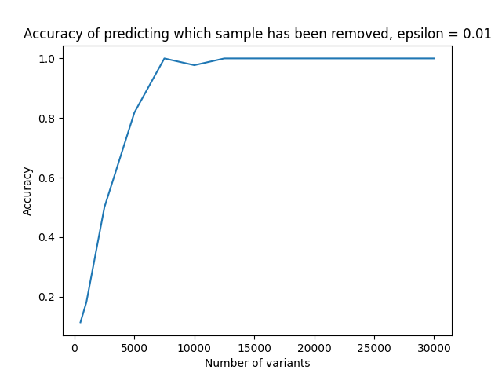
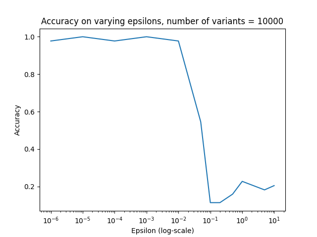

# Human Chromostome 6 privacy challenge, attempt at solution

This is an attempt at solving the [Human chromosome 6 privacy callenge](https://privvg.github.io/2022/09/30/human-chromosome-6-privacy-challenge.html).

We believe the following is the solution to the challenge:

```
0.fa.gz: 
1.fa.gz:
...
```
## Overview of our solution
* Assuming we have an original non-private graph `A` and an epsilon-differentially private graph `B` which is created after removing an unknown individual `i` from `A`. Both graphs contain paths (in the challenge we only observe the sequences of the paths of B). 
* We hypothesise that if something is wrong with the privvg-implementation, then for nodes covered by the individual `i` in `A`, we should be able to observe lower than expected coverage of paths over these nodes in `B`. 
* We don't have access to the graph `B`, but we have access to the error-free sampled path sequences. This means that one should be able to quite easily reconstruct `B` by mapping these path sequences to `A`.
* Then to test whether an individual `i` seems to have been removed when creating `B`, one can check every node that this individual has in graph `A` and that also few other individuals have. If such nodes are covered less than expected by paths in `B` we may conclude that `i` has been removed. It is not obvious what "less than expected" would be here, but one could perform this analysis for all individuals and pick the individual that seems to be stick out.


### Testing whether our idea could work
We did some simulations to test whether our approach could work. We simulated a simple graph in GFA format and generated differentially private graphs and sampled haplotypes according to the recipy given in the competition instructions.

A problem with mapping reads back to `A` to look at node coverage is that mapping 30x reads for multiple individuals at chromosome 6 will take some time (easily a few hours for each individual). To be able to test things quickly and play around with parameters, we believe the above described approach should also work when looking at kmer frequencies instead of node coverage (a bit similar to the approach of [KAGE](https://github.com/ivargr/kage)). I.e., instead of looking for nodes with lower than expected coverage, we assume we can look at kmers from `A` with lower than expected coverage in the sequences sampled from `B`. This will not be as accurate as looking at node coverage, but might be good enough, and at least worth trying out before alternatively looking at node coverage.

We use [BioNumpy](https://github.com/bionumpy/bionumpy) to first scan all kmers in the original graph `A`, and pick out "*marker kmers*", which are kmers that occur few times and that few indiviudals have in `A`. We then count how many times these kmers occur in the path sequences in `B` and look for individuals from `A` with lower counts in `B` than one should expect if they were still in the graph.

On simulated data, this approach gave a 100% prediction accuracy with `epsilon=0.01` on a graph with *10 000 variants* and *44 individuals* (the real chromosome 6 graph has more than a million variants) on a "leave-one-out" experiment where we iteratively removed one of 44 individuals from the graph. The accuracy decreased with fewer variants, but around 10 000 seemed to be enough to correctly predict which individual had been removed in every case, meaning privacy has been breached (so something seems to be wrong with the implementation/concept of privvg).

We played around a bit with how many variants we needed. Note that this simulated data is a bit naive in that sequences are completely random, so most kmers are probably unique. Also, there are probably no "strange" individuals with e.g. mostly rare variants or no rare variants.




We also experimented with different epsilon-values, but we were confused on the role of epsilon here (see notes at the end). In general, lower epsilon did not make it more difficult to get correct predictions, but a higher epsilon made things worse (likely because a high epsilons means that only the most frequent alleles are sampled).



### Solving the real case
Since the approach describe above works so well on small simulated graphs, we think the same approach should work on the much larger chromosome 6 graph.

Before solving the real case, we made a bunch of samples to test on by following the procedure given in the challenge description. For every individual in the provided chromosome 6 graph, we made a differentially private graph by removing that individual and tried to predict which individual was removed. Also here, we got a 100% accuracy, so assuming that the challenge data has been created using the same process, we would expect the accuracy on that also to be 100%.

## Reproducing our results
We have implemented the solution is a small Snakemake pipeline. Dependencies (BioNumpy, odgi, and a few Python packages) should be installed automatically through Conda. 

To run the prediction of the real data, run:

```bash
snakemake --use-conda --cores 2 challenge_solution.txt
```

The results can then be found in the file `challenge_solution.txt`.

It takes a few hours or so to scan and find marker kmers in the original chromosome 6 graph. The hashtable we use for counting kmers is a bit memory demanding, so one should have around 30GB of memory available. Try running with fewer cores if you run out of memory, and more cores to make it faster if you have enough memory available.


Running on a small simulated graph with 10 000 nodes is quick and should only take a few minutes:
```bash

```


``` 
snakemake --use-conda --cores 8 --resources mem_gb=30 -R count_marker_kmers_in_priv_graph data/real/all_predictions_e0.01.txt
```


* We believe there might be a problem in the implementation/interpretation of the "Composition theorem". According to [the description here](https://privvg.github.io/2022/06/13/Differential-Privacy.html), the privvg-developers say that:
```
It suffice to say that when one makes differentially private queries in succession, the result also preserves privacy.
```
We are no experts on differential privacy, but our intuition tells us that if there is epsilon-differential privacy at each single variant, this means that there should be less privacy and more information when looking at multiple variants. From our understanding, the priacy might even be as bad as `k * epsilon` for k variants ()

* We believe there might be an error/mistake in the implementation in that there is only epsilon-differential privacy at each single variant, but when variants are preserved  

## Running on simulated data
``` 

```


## How to reproduce
###
```
# get data sets
wget ...

# run the prediction
snakemake --use-conda data/test/all_predictions.txt
```

## Some speculation and notes
* We have a feeling that the competion creators might be wrong in their assumption about the "composition theorem", i.e. assuming that if there is epsilon-differential privacy at a single variant, then privacy is also preserved when querying multiple variants. We don't know the theory here, but according to e.g. [this paper](https://arxiv.org/abs/1311.0776) it seems that the privacy when performing `k` samples in worst case can be `epsilon * k`, which intuitively also makes somewhat sense. Maybe this is why our approach works, but we're not in any way certain here. However, we do observe that it gets easier to predict as there are more variants in the graph, so the privacy is not independent on the number of variants, as is [indicated on the privvg blog](https://privvg.github.io/2022/06/13/Differential-Privacy.html): `It suffice to say that when one makes differentially private queries in succession, the result also preserves privacy`.
* We experience that it is more difficult to get correct predictions with larger epsilon. It seems that with a large epsilon only major alleles are chosen, which makes sense since the probability-weight of choosing these alleles grows exponentially according to the exponential mechanism. We thus have a feeling that the exponential mechanism does not make so much sense for this problem, since we would rather  want the allele frequencies to be closer to the true allele frequencies with larger epsilon. All examples we can find using the exponential mecanism are focused on cases where one would prefer to get the element with the highest score (utility), but this is not the case here we believe. Maybe the exponential mechanism is a wrong approach to take for differential privacy on pangenomes? This could be interesting to discuss further. 
* In the challenge description, the developers say that `[the sequences sampled from the graph are] less likely to expose private information than the graph`. We believe this assumption might be a bit naive, and that an implementation of differential privacy should first and foremost make sure that the graph satifies differential privacy and not rely on increased privacy by sampling sequences. As long as we have the original graph that the differential private graph has been created from (which we have in our case), then in theory the differential private graph can be reconstructed by mapping the reads to this graph. Mapping these reads should be easy since they are sampled without errors. This is true as long as nodes with zero haplotypes are removed from the differential private graph (which we think they should be).

## Work by
* Ivar Grytten (ivargry@ifi.uio.no)
* Knut Rand (knutdr@ifi.uio.no)


